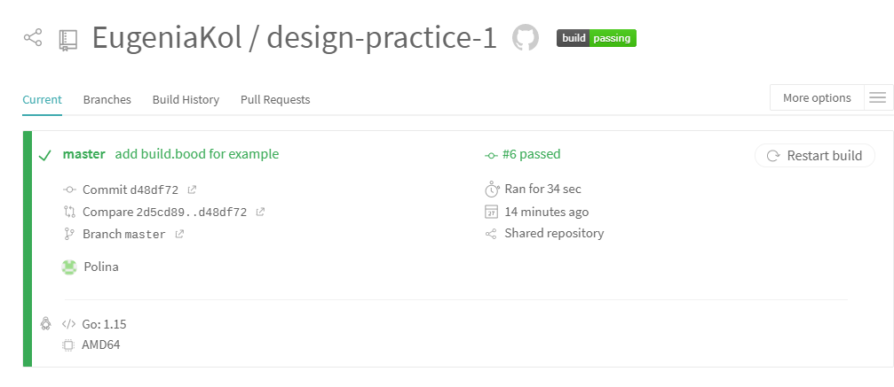
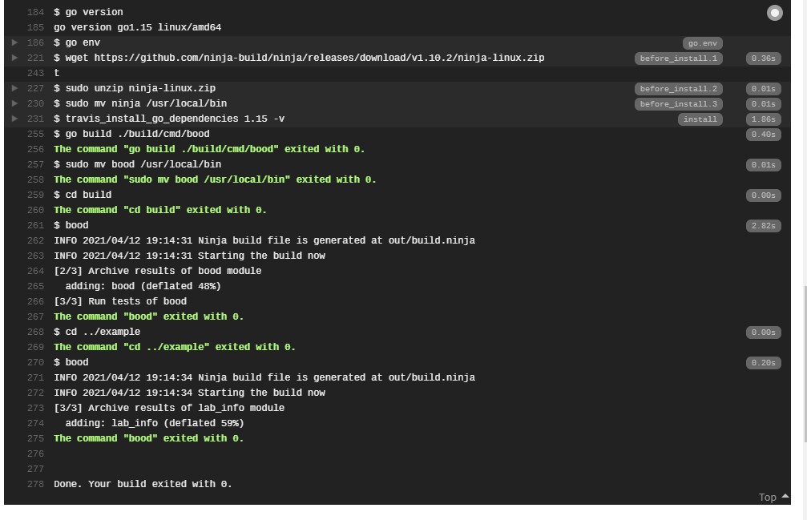

##### Лабораторна робота №1 

## Проектування та реалізація системи збірки
 

**Мета**: Набуття навичок імплементації інкрементальної збірки та дизайну проблемноорієнтованих мов

#### Скриншоти Travis CI

